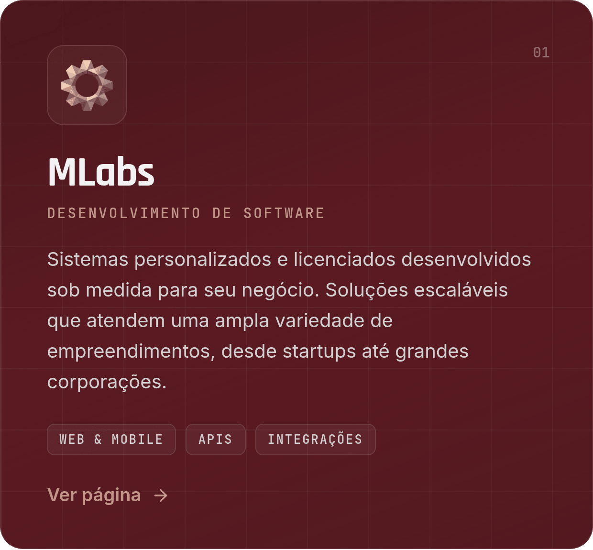
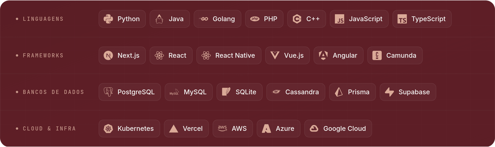
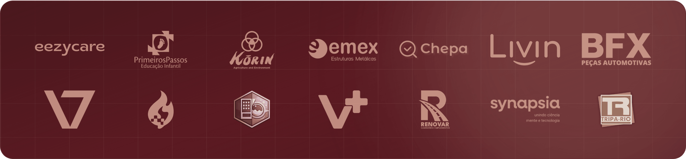

 
 

 

## Tecnologia com lastro de engenharia

**Não vendemos ferramenta avulsa. Construímos a operação digital inteira e ficamos responsáveis por ela.**

A **MFactor** une tecnologia, estratégia e criatividade para impulsionar o crescimento de negócios em múltiplas frentes.

De hospedagem e infraestrutura digital a marketing de performance, automações e desenvolvimento de sistemas sob medida, oferecemos um ecossistema pensado para tornar sua operação mais eficiente, moderna e escalável.

Nosso compromisso é transformar desafios em oportunidades, conectando empresas às melhores ferramentas e estratégias para evoluírem com consistência e resultados reais.

 

## Cinco frentes, um só time

Soluções integradas para acelerar sua transformação digital — cada frente com especialistas próprios e um ponto de contato só.

  
  
  
  
  

| Frente | O que entregamos | Para quem |
| :-- | :-- | :-- |
| [**MLabs**](https://www.mfactor.dev/servicos/mlabs) | Web & mobile · APIs & integrações · Metodologia ágil · Suporte contínuo | Startups, PMEs e grandes corporações |
| [**MReach**](https://www.mfactor.dev/servicos/mreach) | Lojas & checkout · Social commerce · SEO técnico · Analytics | Varejistas, marcas, empresas B2B e criadores de conteúdo |
| [**MHost**](https://www.mfactor.dev/servicos/mhost) | Kubernetes · Bancos gerenciados · Observabilidade · CI/CD | Empresas SaaS, e-commerces, aplicativos e sistemas corporativos |
| [**M-AI & ML**](https://www.mfactor.dev/servicos/mai) | LLMs · Agentes de IA · Automações · Análise preditiva | Empresas que querem aplicar IA aos processos e sistemas existentes |
| [**MPartner**](https://www.mfactor.dev/servicos/mpartner) | Sem marca nossa · Prazo fechado · NDA padrão · Suporte white label | Agências de marketing, estúdios de design, freelancers e consultorias |

 

## O que já está rodando

 

## Produto próprio: Service ERP MFactor

Plataforma criada para centralizar a operação de prestadores de serviços em um único sistema. Com foco especial na construção civil, atende também empresas de manutenção, reformas, instalações e serviços técnicos.

Clientes, projetos, orçamentos, ordens de serviço, equipe, materiais, estoque, compras, pagamentos e financeiro trabalham de forma integrada. O cliente recebe o orçamento pelo celular, aprova, pede alterações e paga por Pix ou cartão, com a confirmação do pagamento acontecendo automaticamente.

- Ordens de serviço com responsáveis, checklist e evidências
- Controle inteligente de materiais e estoque, com alertas que consideram o saldo atual e o consumo previsto
- Perfil e catálogo públicos personalizados
- Integração com Pix e cartão de crédito
- Visão financeira completa da operação

**Facilidade para operar. Inteligência para crescer.** → [service-erp.mfactor.dev](https://service-erp.mfactor.dev)

 

## As ferramentas que sustentam a entrega

Linguagens, frameworks, bancos de dados e infraestrutura cloud que usamos para construir produtos sólidos e escaláveis.

 

## Empresas que confiam na MFactor

Projetos entregues em saúde, varejo, agro, indústria e educação — plataformas, e-commerces e infraestrutura rodando em produção.

| Case | Setor |
| :-- | :-- |
| **EezyCare e EezyFamily** | Saúde — mais de 12 mil pessoas atendidas com o fluxo operacional automatizado |
| **Chepa** | Varejo alimentar |
| **Livin** | Marketplace |
| **Renovar Implementos** | Indústria |
| **Emex Structures** | Indústria |
| **BFX** | Serviços |
| **Synapsia** | Tecnologia |

[Ver o portfólio completo →](https://www.mfactor.dev/showcase)

 

## O que dizem nossos clientes

> Antes do eezyone e do eezyfamily, eu gastava cerca de 23 horas por mês com tarefas operacionais (planilhas, emissão de nota, boletos, envio para clientes e cobranças manuais); hoje, com o desenvolvimento das plataformas da eezycare, todo esse fluxo é automático, reduzindo muito o esforço operacional e a margem de erro, e ainda permitindo escalar a operação com a plataforma eezyfamily, atendendo mais de 12 mil pessoas com qualidade, experiência organizada e baixo custo.
>
> — **Gabriel Machado**, CEO, Eezycare

> A M-Factor é o núcleo tecnológico por trás do Chepa, atuando como o braço estratégico que transforma ideias em soluções robustas, inteligentes e escaláveis. Nossa parceria nasce de um compromisso claro: usar tecnologia de alto padrão para tornar o varejo alimentar mais competitivo, mais eficiente e mais próximo das pessoas.
>
> — **Rodolfo Coelho**, Fundador, Chepa app

> Minha experiência com a Mfactor foi excelente. Além de muito rápidos no atendimento e na entrega, a equipe demonstrou um cuidado real com as particularidades que o projeto exigia. Tudo o que eu precisava foi entendido com precisão e transformado em um resultado acima das minhas expectativas. O site da Livin ficou moderno, funcional e com a identidade que eu buscava. Fiquei muito satisfeito com todo o processo.
>
> — **Ricardo Marchi**, CEO, Livin

 

## Impacto social

Aulas gratuitas de tecnologia para mulheres e mães empreendedoras que querem entrar no mercado. Turmas reduzidas, de 10 pessoas, com aulas ao vivo e gravadas.

[Conhecer os cursos gratuitos →](https://www.mfactor.dev/curso)

 

 
 

  
    <a href="https://wa.me/5519971485856">+55 (19) 97148-5856</a> ·
    <a href="mailto:alexandre.martins@mfactor.dev">alexandre.martins@mfactor.dev</a> ·
    <a href="https://www.mfactor.dev">www.mfactor.dev</a>
     
    MFactor · Transformando desafios em oportunidades através da tecnologia · Feito em Leme, SP
  

